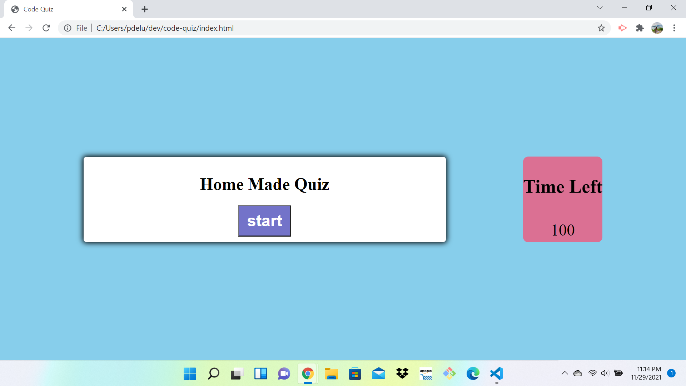

# code-quiz

# what starting data will my application need?
- questions and answers
-  array list for our series of questions
-  each question will an object
   {
       questions: "commonly used data types DO NOT include: "       
       multipleChoiseOptions: [
           "string:,
           "boolean",
           "alert",
           "number"
       ],
       correct: "alert"
   }

- timer and score

# what kind of actions does my application need to do?

 - start game action
     -function start game(){  ...   }

 - hide welcome message
     -function  hide welcome(){  ...   }

 - display the next questions
      -function  displayNextQuestion(){  ...   }

 - start the countdown timer 

 - validate the users choice 
    (if else )
    - if the choice is wrong, subtract time from timer
 
 - display the next question

 - display the answer result

 - end the game

 # create High Score Page 
  - created page to store user initials and high scores. 
  - created a link to return user to main page

  

         
         LINKS
repo:

https://github.com/deluus/code-quiz

page: 

https://deluus.github.io/code-quiz/

